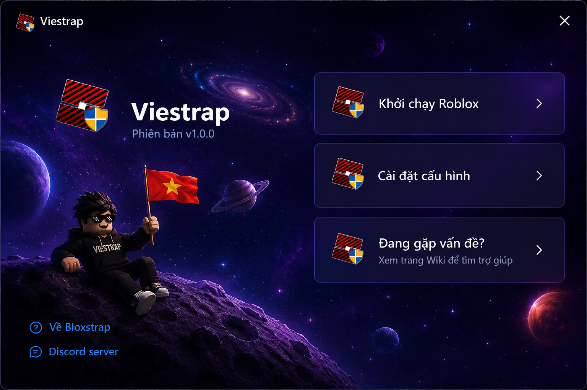
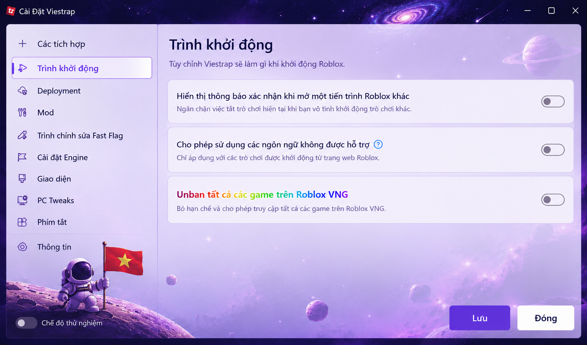
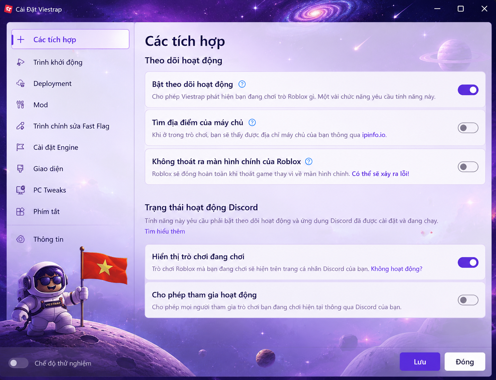

<div align="center">

# Viestrap

**An alternative bootstrapper for Roblox, providing extra features and customizability.**

<br>

<a href="https://github.com/Viestrap-official/Viestrap/releases/latest">
  
</a>

<a href="https://discord.gg/dwWsupz7v">
  
</a>

<br><br>



</div>

---

## 🚀 Cập nhật quan trọng (19/07/2026)

> [!IMPORTANT]
> **Tính năng hỗ trợ truy cập server quốc tế:** Viestrap được tích hợp giải pháp tối ưu giúp người dùng tại Việt Nam dễ dàng kết nối trực tiếp tới các máy chủ Roblox quốc tế, hạn chế các lỗi kết nối và tình trạng bị giới hạn truy cập ở một số khu vực.
>
> Điều này giúp trải nghiệm các tựa game như **Blox Fruits**, **99 Nights**, **GAG 2** và nhiều trò chơi khác ổn định và mượt mà hơn.

<div align="center">
  
</div>

---

## 📥 Hướng dẫn tải và cài đặt

<List marker="decimal" gap={2}><List.Item>Truy cập trang phát hành mới nhất:  
   👉 <Link url="https://github.com/Viestrap-official/Viestrap/releases/latest" title="https://github.com/Viestrap-official/Viestrap/releases/latest"/>
  </List.Item><List.Item>Trong mục **Assets**, tải file **Viestrap.exe**.
  </List.Item><List.Item>Nếu Windows Defender hiển thị cảnh báo *False Positive* (nhận diện nhầm), hãy đảm bảo bạn tải đúng từ trang phát hành chính thức của dự án.
  </List.Item><List.Item>Chạy ứng dụng và tận hưởng trải nghiệm Roblox với nhiều tùy chọn nâng cao.
  </List.Item></List>

---

## 🎨 Giao diện & tính năng

<table>
  <tr>
    <td width="50%" valign="top">

### 🌟 Giao diện hiện đại

Được xây dựng trên nền tảng **WPFUI**, Viestrap mang đến giao diện trực quan, tối giản và dễ sử dụng cho cả người dùng mới.

### 🎨 Tùy biến cá nhân hóa

Hỗ trợ nhiều bộ giao diện (theme) và tùy chọn màu sắc, cho phép bạn cá nhân hóa cả trình khởi chạy và Roblox client.

### 📊 Thông tin máy chủ thời gian thực

Hiển thị khu vực server, ping và thời gian hoạt động thông qua **RoValra API**, giúp theo dõi kết nối chính xác hơn.

### ⚡ Hiệu năng tối ưu

Tối ưu quy trình khởi chạy để giảm thời gian mở game và cải thiện độ ổn định trong quá trình sử dụng.

</td>
    <td width="50%" valign="middle">
      
    </td>
  </tr>
</table>

---

## 🛠️ Cài đặt nhanh bằng Terminal

Mở **Windows Terminal** và chạy lệnh sau:

```bash
winget install viestrap
```

---

## 💬 Hỗ trợ cộng đồng

Tham gia Discord để nhận hỗ trợ, báo lỗi hoặc trao đổi với cộng đồng người dùng:

👉 **https://discord.gg/dwWsupz7v**

---

## 📌 Lưu ý

- Viestrap là dự án cộng đồng và không trực thuộc Roblox Corporation.
- Luôn tải ứng dụng từ **trang GitHub chính thức** để đảm bảo an toàn.
- Nếu gặp sự cố sau khi cập nhật Roblox, hãy kiểm tra mục **Releases** để tải phiên bản mới nhất.

---

<div align="center">

**Made with ❤️ by the Vietnamese Roblox community**

</div>
